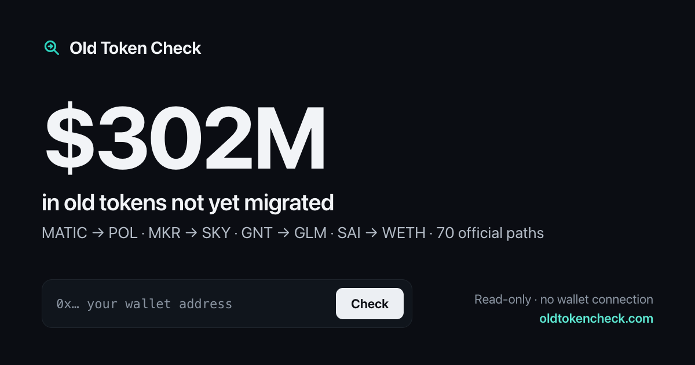

# Old Token Check

**[oldtokencheck.com](https://oldtokencheck.com)** — paste a wallet address and find legacy tokens you can still migrate through an official contract (MATIC → POL, MKR → SKY, GNT → GLM, SAI → WETH and more).



## Why trust it

- **Read-only.** The site has no wallet code at all. It never asks you to connect or sign anything. You send every transaction yourself, from your own wallet.
- **Proven, not guessed.** For every balance it finds, it simulates the full migration (usually `approve` then the migrate call) from your address with your whole balance, using `eth_simulateV1` — or `eth_call` with a state override on chains whose public RPCs lack it. A result is only marked **Ready** when that simulation succeeds and you actually receive the new token.
- **A verified list.** Each of the 70 open paths in [`data/`](data) names the old token, the new one, the official migrator and the exact calls. Before listing, every path was simulated from a real holder and checked against official docs. The 49 candidates that failed (closed, paused, defunded, unverifiable) are in `data/rejected.*.json` and are never shown as claimable.
- **Balances straight from the chain.** Explorer holder lists for old tokens are often stale, so balances are read with `balanceOf` through Multicall3.
- **Staked and locked tokens too.** Old tokens often sit in a staking, vote-escrow, escrow or grant contract instead of the wallet: MKR in Maker's chiefs, vote proxies, vote delegates and LockStake; veOCEAN and Velodrome v1 veNFTs; staked or escrowed KWENTA; OGV lockups; KEEP stakes and grants; NU, KNC, RBN, dQUICK, TRIBE rewards. Each is described as a small read program (see [research/HOLDINGS.md](research/HOLDINGS.md)), and the full exit plus migration is simulated from your address. Locks that end in the future are simulated at their unlock date and shown as **Unlocks on &lt;date&gt;**.

## How it works

| Piece | What it does |
|---|---|
| `data/registry.*.json` | The migration paths (schema in [SCHEMA.md](SCHEMA.md)) |
| `lib/scan.js` | Reads balances per chain, simulates each migration, checks payout reserves and status |
| `lib/evm.js` | ABI encoding, RPC client with failover, Multicall3, simulation helpers |
| `chains.js` | Chain list and public RPCs; `RPC_OVERRIDES` for your own endpoints |
| `app.js` | Renders results and the step-by-step Etherscan instructions |

USD values come from DefiLlama's public price API.

## Run locally

```bash
python3 tools/serve.py 8766   # then open http://localhost:8766
```

No build step and no dependencies. It's plain HTML, CSS and ES modules.

## Deploy

```bash
./tools/build.sh          # copies only the public site into dist/
npx wrangler deploy       # Cloudflare Workers static assets (see wrangler.jsonc)
```

`python3 tools/build_stats.py` refreshes the headline numbers in `data/stats.json`; `python3 tools/make_og.py` redraws the share card.

## Add a migration path

Open a PR that adds an entry to `data/registry.eth.json` or `data/registry.multichain.json` following [SCHEMA.md](SCHEMA.md). Include a `verification` block showing a successful simulation from a real current holder, and link the official source.

## Safety

Only ever migrate through the official contracts listed on a result. Nobody needs your seed phrase, and approvals should only ever go to the listed migrator. Not investment advice.

## Support

Free to use. If it found something you forgot about, buy me a coffee: `0x17D70f1Bd8900f7253283f5eb9f1832DEc888888` (any EVM chain, any token).

## License

[MIT](LICENSE)
